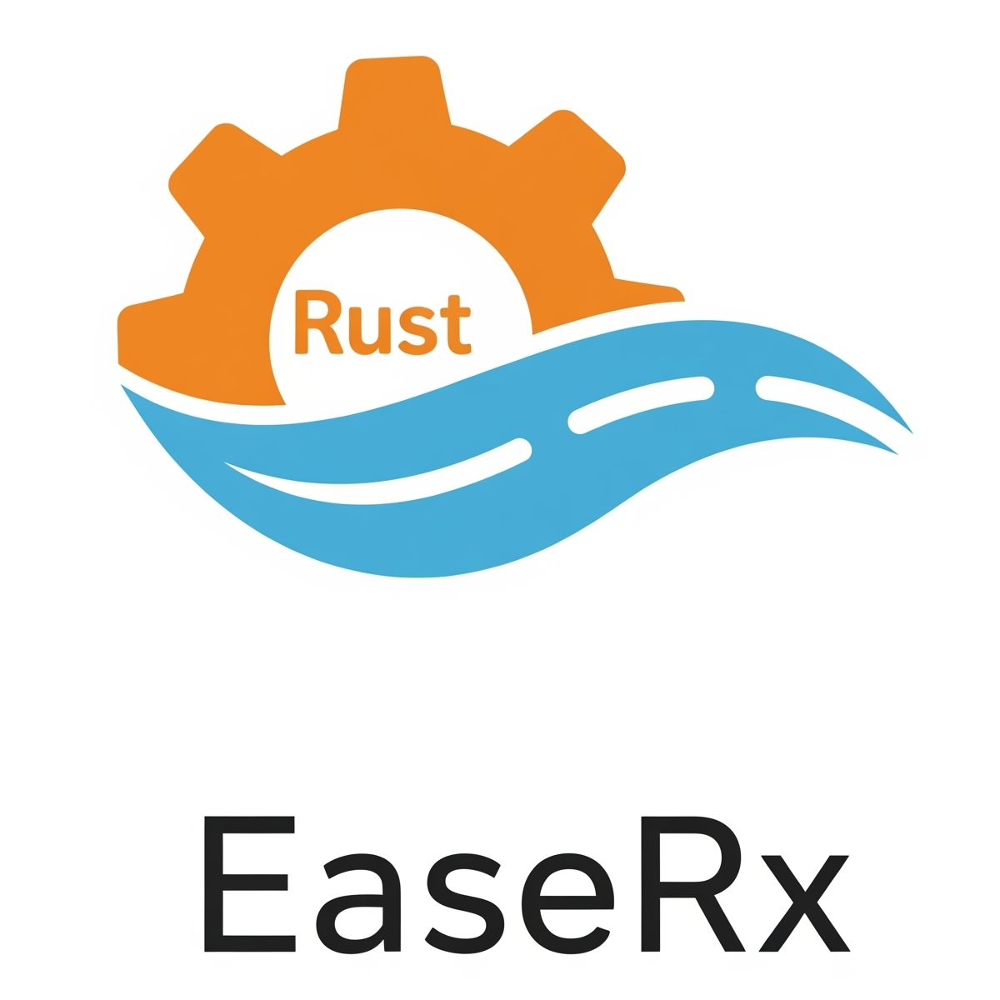
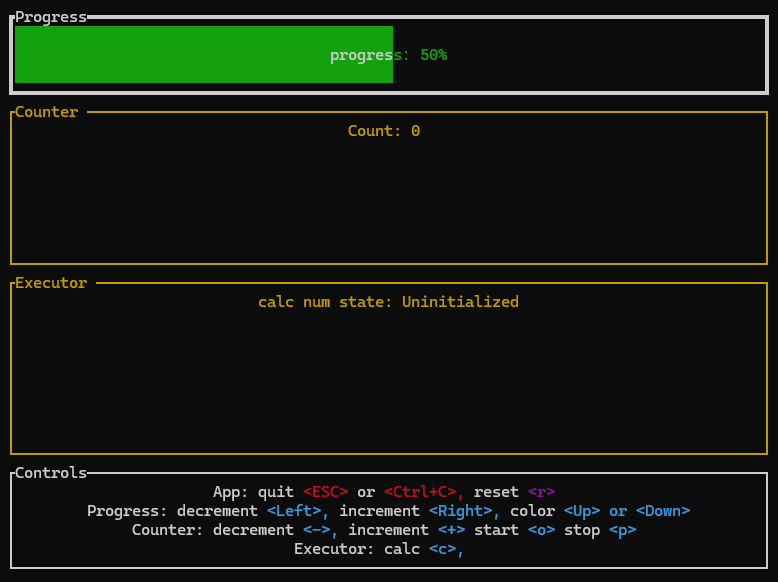
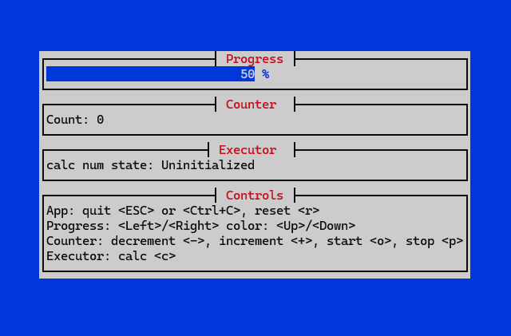

# EaseRx - Reactive MVI Framework for Rust

[](https://opensource.org/licenses/MIT)



EaseRx is a reactive MVI (Model-View-Intent) framework for Rust, designed to reduce the mental burden of Rust's asynchronous programming and provide a concise and intuitive state
management solution.

## [中文README](README_CN.md)

## [Documentation](https://wmywork.github.io/easerx)

## Project Overview

* Rust has a steep learning curve, especially when dealing with asynchronous programming and state management.
* EaseRx provides one main component and several simple methods, along with detailed examples.
* It uses safe Rust, offering a simple, easy-to-understand, and easy-to-use API.
* It allows developers to write asynchronous code as if it were synchronous, with automatic error conversion, simplifying the development process.

## Use Cases

* **UI State Management**: Managing component states in GUI applications.
* **Network Request Handling**: Handling loading states, successful responses, and error conditions.
* **Time-Consuming Operation Handling**: Managing time-consuming operations such as file I/O and data processing.

## Technical Dependencies

* [tokio](https://github.com/tokio-rs/tokio): Asynchronous runtime.
* [futures-signals](https://github.com/Pauan/rust-signals): Reactive programming support.
* [thiserror](https://github.com/dtolnay/thiserror): Error handling.
* [pin-project](https://github.com/taiki-e/pin-project): Pin projection.

## Examples

* This project uses the `just` tool to run examples. To install just: ```cargo install just```. For more details about just, please explore [just.systems](https://just.systems/).
* Open a terminal or command prompt in the project root directory and type `just` to see all `just` commands, or you can directly open the `justfile` in the project root directory
  to view all commands.
* To run an example: `just todo`.

### ratatui example

- To run the example: `just ratatui`.

- 

### cursive example

- To run the example: `just cursive`.

- 
