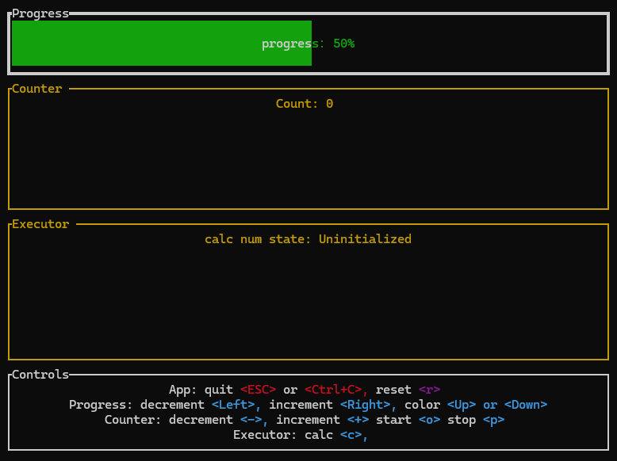

# EaseRx - Rust响应式MVI框架

[](https://opensource.org/licenses/MIT)


EaseRx是一个Rust语言的响应式MVI (Model-View-Intent) 框架，旨在降低Rust异步编程的心智负担，提供简洁直观的状态管理方案。

## [English README](README.md)

## [文档](https://wmywork.github.io/EaseRx/)

## 项目概述

- Rust的学习曲线较陡峭，尤其是在处理异步编程和状态管理方面
- EaseRx提供1个主要组件和几个简单的方法，并提供详尽的示例
- 使用安全rust，没什么魔法，API简单，易于理解和使用
- 让开发者能够以同步代码的写法编写异步代码，并自动完成错误转换，从而简化开发过程。

## 使用场景

- **UI状态管理**：在GUI应用中管理组件状态
- **网络请求处理**：处理加载状态、成功响应和错误情况
- **耗时操作处理**：处理耗时操作，如文件读写、数据处理等

## 技术依赖

- [tokio](https://github.com/tokio-rs/tokio)：异步运行时
- [futures-signals](https://github.com/Pauan/rust-signals)：响应式编程支持
- [thiserror](https://github.com/dtolnay/thiserror)：错误处理
- [pin-project](https://github.com/taiki-e/pin-project)：Pin投影

## Examples
- 本项目采用just工具来运行example，安装just：```cargo install just```，关于just的详情请自行探索[just.systems](https://just.systems/)
- 在项目根目录打开终端或命令行，查看所有just指令: ```just```，或者也可以直接打开项目根目录的justfile文件查看所有指令
- 运行example: ```just todo```

### ratatui example
- 运行example: ```just ratatui```

- 

### cursive example
- 运行example: ```just cursive```

- 
